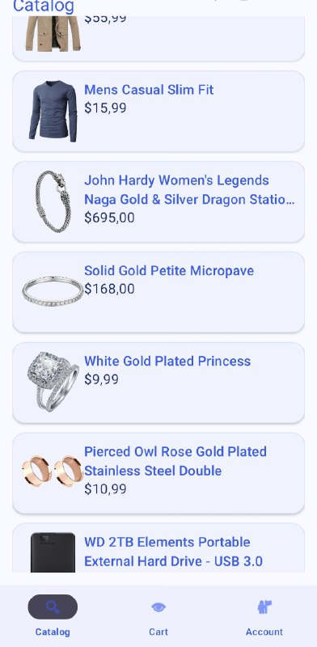
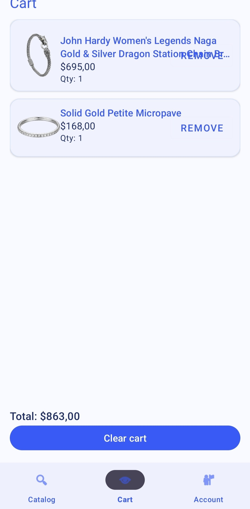
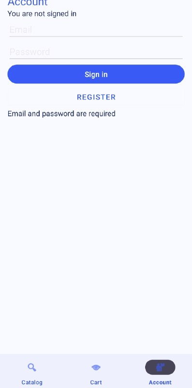

# SneakyPeaky

Android‑приложение магазина кроссовок с каталогом, карточками товаров, корзиной и аккаунтом. Данные берутся из FakeStore API, а аутентификация выполняется через Firebase (Email/Password).

## Скриншоты

```



```

## Функциональность

- каталог товаров с загрузкой из API
- карточка товара
- корзина (добавление, удаление, очистка)
- аккаунт: регистрация, вход, выход (Firebase Auth)

## Источник данных

- FakeStore API: https://fakestoreapi.com/

## Сборка и запуск

Команда для сборки:
```
./gradlew assembleDebug
```

